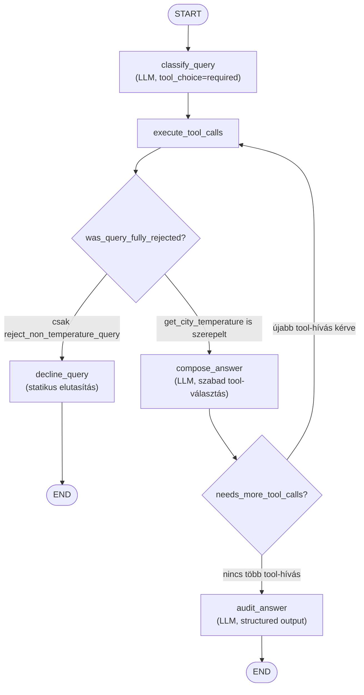

# Egyszerű időjárás agent — fejlesztői dokumentáció

Ez a dokumentum a `simple-weather-agent` implementáció belső felépítését, a
LangGraph-alapú agent gráfját és a főbb tervezési döntéseket mutatja be. A
felhasználói szempontú leírásért (futtatás, környezeti változók) lásd a
[README.md](README.md) fájlt.

## Áttekintés

Az agent egy [LangGraph](https://www.langchain.com/langgraph) állapotgéppel
(state graph) van megvalósítva, amely egy OpenAI API-kompatibilis LLM-et
(`langchain-openai` `ChatOpenAI`) hangszerel a következő szigorú
szabállyal: **kizárólag** városok **jelenlegi** hőmérsékletére vonatkozó
kérdéseket válaszol meg, minden mást elutasít — még akkor is, ha a kérdés
csak részben (összetett kérdés esetén) érinti ezt a témát.

Az időjárási adatokat az [Open-Meteo](https://open-meteo.com/) nyilvános
geokódoló és előrejelző API-ja szolgáltatja, `requests`-szel hívva
(`weather_agent/open_meteo_client.py`).

## Modulok

### `weather_agent/main.py` — CLI belépési pont

- Betölti a `.env` fájlt (`python-dotenv`), felépíti a `ChatOpenAI` klienst
  (`OPENAI_API_KEY`/`OPENAI_MODEL`/`OPENAI_BASE_URL` környezeti változókból),
  létrehozza az `OpenMeteoClient`-et és a hozzá tartozó tool-okat, majd egy
  `WeatherAgent` példányt.
- Interaktív stdin ciklusban olvassa a kérdéseket, amíg a felhasználó
  `exit`-et nem ír be vagy EOF nem érkezik.
- A `--verbose`/`-v` kapcsoló a `WeatherAgent.run(..., verbose=True)`-t
  hívja, amely a `graph.stream(..., stream_mode="values")` segítségével
  minden köztes állapotot (minden LLM-hívást, tool-hívást és azok
  eredményét) kiírja a konzolra `pretty_print()`-tel — **ez teljesíti a
  feladat azon követelményét, hogy minden agent-futásnál végig lehessen
  követni a reasoning és tool-calling lépéseket.**

### `weather_agent/open_meteo_client.py` — Open-Meteo HTTP kliens

Vékony wrapper két Open-Meteo végpont köré:

- `geocode(city)`: a geokódoló API-t hívja (`geocoding-api.open-meteo.com`),
  és az első (legjobb) találatot adja vissza `CityLocation`-ként. Ha nincs
  találat, `CityNotFoundError`-t dob.
- `get_current_temperature(location)`: az előrejelző API-t hívja
  (`api.open-meteo.com/v1/forecast`) a `current=temperature_2m` paraméterrel,
  és `CurrentTemperature`-t (érték + mértékegység) ad vissza.
- Mindkét hívás hálózati hibáit `OpenMeteoRequestError`-ba csomagolja, hogy a
  tool-réteg egységesen tudja kezelni őket.

### `weather_agent/tools.py` — LangChain tool-ok

A `build_tools(client)` factory függvény (nem modul-szintű `@tool`
dekorált függvények) két tool-t épít fel, az `OpenMeteoClient`
függőség-injektálásával a konstrukció idején, hogy a tool-testek ne
tartalmazzanak hard-code-olt klienspéldányt:

- **`get_city_temperature(city)`**: egy adott város jelenlegi
  hőmérsékletét adja vissza szöveges formában (vagy hibaüzenetet, ha a
  város nem található, vagy a lekérdezés sikertelen). Több városos kérdés
  esetén az LLM ezt városonként külön hívja meg.
- **`reject_non_temperature_query(query)`**: egy statikus elutasító
  sablon-szöveget ad vissza minden olyan al-kérdésre, amely nem egy város
  jelenlegi hőmérsékletére vonatkozik.

### `weather_agent/agent.py` — a LangGraph állapotgép

Ez a modul tartalmazza az agent tényleges logikáját. A gráf csomópontjai:

| Csomópont | Szerep |
|---|---|
| `classify_query` | Az LLM-et `tool_choice="required"`-del hívja, hogy **kötelezően** dekomponálja és osztályozza a felhasználói kérdést egy vagy több tool-hívássá (`get_city_temperature` és/vagy `reject_non_temperature_query`), sosem válaszolhat közvetlenül. |
| `execute_tool_calls` | Lefuttatja az előző lépésben kért összes tool-hívást, és az eredményeket (`ToolMessage`) az állapotba (`AgentState.last_tool_messages`) menti, hogy a következő döntési pont ne kelljen újra végigpásztázza a teljes üzenet-történetet. |
| `was_query_fully_rejected` (feltételes él) | Megvizsgálja, mely tool-ok hívódtak meg: ha **kizárólag** `reject_non_temperature_query` (tiszta elutasítás), a `decline_query`-be irányít; ha `get_city_temperature` is szerepel közte (tiszta hőmérséklet-kérdés vagy vegyes/összetett kérdés), a `compose_answer`-be. |
| `decline_query` | Egy statikus, kódban rögzített elutasító üzenetet ad vissza végső válaszként — így egy tisztán irreleváns kérdés válasza garantáltan azonos szövegű, nem az LLM parafrazeálja. |
| `compose_answer` | Az LLM-et tool-kényszer nélkül hívja, hogy természetes nyelvű választ fogalmazzon meg a tool-eredmények alapján; szükség esetén további tool-hívást is kérhet (pl. ha egy összetett kérdés több várost is érint). |
| `needs_more_tool_calls` (feltételes él) | Ha a `compose_answer` további tool-hívást kért, vissza az `execute_tool_calls`-hoz; egyébként az `audit_answer`-hez. |
| `audit_answer` | Az LLM-et **strukturált kimenettel** (`OutputCheck` Pydantic modell) hívja meg, és a teljes eddigi beszélgetés alapján megkérdezi, hogy a végső válasz tartalmaz-e bármilyen nem-hőmérséklet-jellegű információt. Ha igen, a választ lecseréli ugyanarra a statikus elutasító üzenetre, amit a `decline_query` is használ. |

#### A gráf mermaid diagramja

#### Miért két külön "elutasítás elleni védelem" (`classify_query` + `audit_answer`)?

A tervezés két, egymást kiegészítő védelmi rétegre épül, mert egyik réteg
sem garantálja önmagában a szigorú témakorlátozást:

1. **`classify_query`** kényszerített tool-választással biztosítja, hogy a
   modell **sosem válaszolhat közvetlenül** — mindig valamelyik tool-t
   (vagy mindkettőt, összetett kérdés esetén) kell hívnia. Ez korán
   szétválasztja a kérdés releváns és irreleváns részeit.
2. **`compose_answer`** egy sima, szabad LLM-hívás, ami **nem garantálja**,
   hogy hűen közvetíti a `reject_non_temperature_query` tool üzenetét, vagy
   hogy teljesen kihagyja a nem-időjárási rész megválaszolását — pl.
   "véletlenül" válaszolhat egy vegyes kérdés elutasított felére is.
3. Emiatt a **`audit_answer`** nem bízik a `compose_answer` kimenetének
   struktúrájában: a teljes beszélgetés kontextusában (nem csak az
   önmagában vizsgált végső válaszban) megkérdezi az LLM-et, hogy szivárgott-e
   át nem-időjárási információ, és ha igen, kódban, determinisztikusan
   cseréli le a választ az egységes elutasító szövegre — az LLM tehát csak a
   *detektálásért*, nem a *válasz szövegezéséért* felel ebben a lépésben.

#### Beszélgetés-állapot és checkpointing

Minden `WeatherAgent` példány saját `InMemorySaver` checkpointer-t és egy
véletlenszerűen generált `thread_id`-t tart fenn, így egyazon példányon
végzett egymást követő `run()` hívások egyetlen, folytatólagos
többfordulós beszélgetésként kezelődnek (a `MessagesState` `add_messages`
reducer-e automatikusan egyesíti a korábbi üzeneteket az újakkal). A
checkpointer belső implementációs részlet (nincs kívülről injektálva),
mivel sosem olvassák vagy kezelik kívülről; a beszélgetés-történet
szándékosan elvész, amint a példány megszűnik (nincs lemezre írt
perzisztencia).

## Tesztelés

A `tests/` könyvtár end-to-end teszteket tartalmaz (`test_weather_agent_e2e.py`),
amelyek a **valódi** OpenAI API-t és a **valódi** Open-Meteo API-t hívják —
egyik komponens sincs mockolva, a teljes gráfot végigfuttatják. A tesztek a
gráf három lehetséges útvonalát fedik le:

- tiszta hőmérséklet-kérdés (`compose_answer` / `audit_answer` útvonal),
- összetett kérdés (hőmérséklet + irreleváns rész keveréke),
- tiszta irreleváns kérdés (`decline_query` rövidre zárása).

A szabadszöveges válaszok helyességét egy másik LLM ítéli meg strukturált
kimenettel (`evaluation.py`), ugyanazt a megközelítést tükrözve, amit az
agent maga is használ az `audit_answer` csomópontban. Az ítész
(`judge_llm` fixture) szándékosan egy erősebb modell, mint a tesztelt agent
modellje, hogy elkerülje a modellek közös vakfoltjait.

Futtatás: `pytest -s -m e2e` (érvényes `OPENAI_API_KEY` szükséges hozzá; lásd
`tests/conftest.py`). A `-s` kapcsoló kikapcsolja a pytest stdout-capture-ét,
hogy minden teszt kérdés/válasz párja látható legyen sikeres futás esetén is.

Ehhez a teszt-futtatáshoz nincs külön `run.sh`, mert ez fejlesztői/CI
eszköz, nem a végfelhasználói futtatás része; a `pyproject.toml`
`[project.optional-dependencies].test` csoportja (`pytest`) tartalmazza a
szükséges függőséget.

## Ismert korlátok / jövőbeli fejlesztési lehetőségek

- **Nincs streaming a végfelhasználó felé**: a `--verbose` mód a teljes
  köztes állapotokat írja ki, de a végső választ csak a folyamat végén,
  egyben (nem tokenenkénti streaming-gel).
- **A checkpointer csak memóriában él**: a beszélgetés-history egy
  program-újraindítás után elvész.
- **Egyetlen geokódolási találat**: a `geocode()` mindig csak az első
  (`count=1`) Open-Meteo geokódolási találatot használja, nincs
  egyértelműsítés több azonos nevű város esetén (pl. "Springfield").
